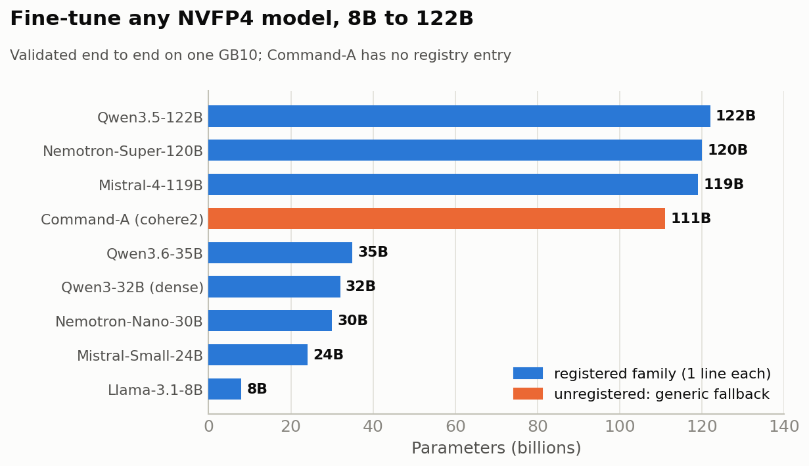
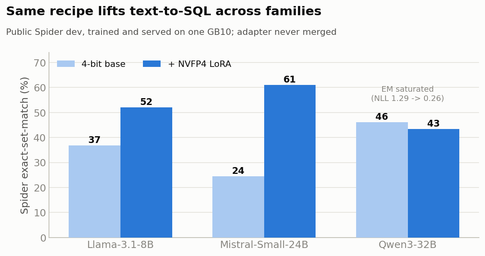
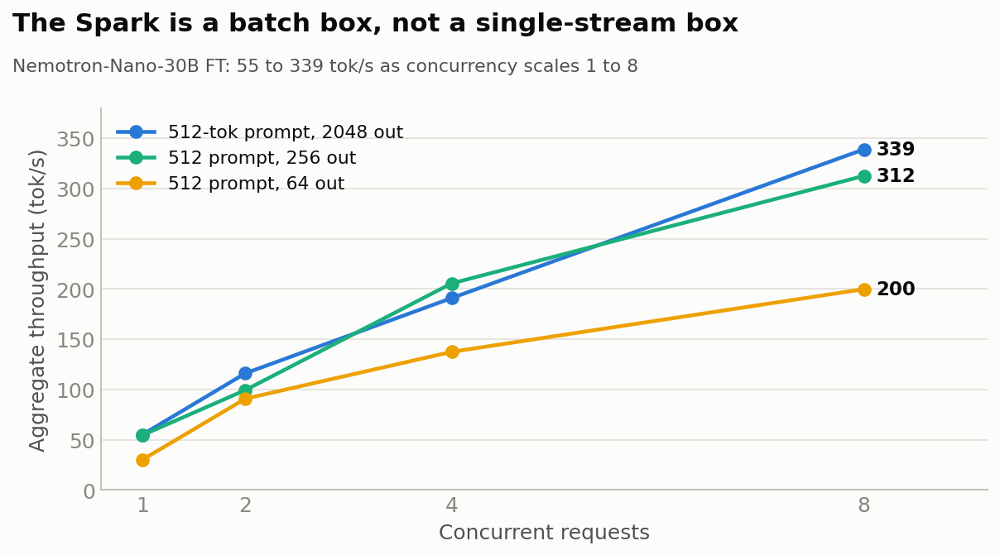
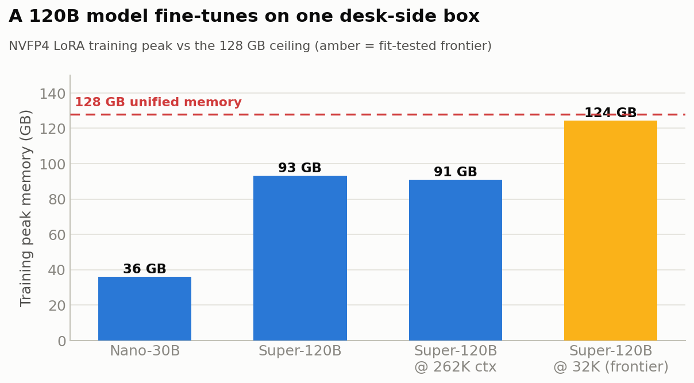
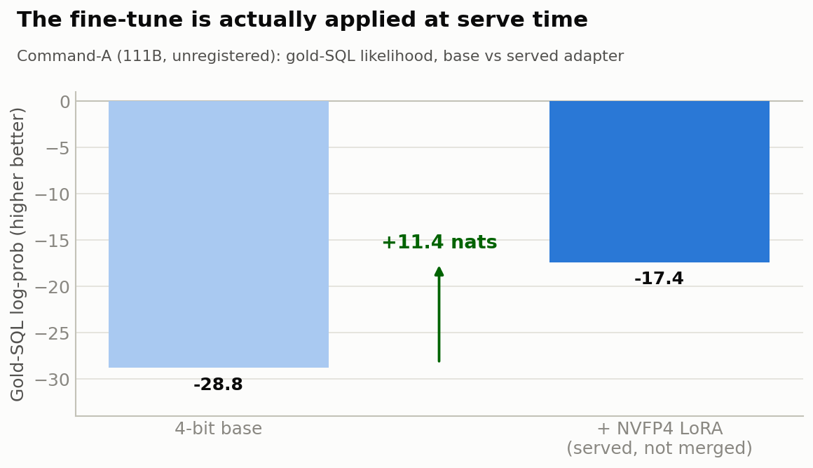

# nybbloris

[](https://github.com/NvMayMay/nvfp4-lora-spark/actions/workflows/ci.yml)
[](LICENSE)
[](pyproject.toml)
[](#target-hardware)

**Fine-tune a 100B+ MoE on the 4-bit weights NVIDIA actually ships — on one desk-side box — and prove the adapter didn't silently die.**

NVIDIA and partners ship the largest open MoE families in **NVFP4** (4-bit) so models
well past the 100B class fit on a single 128 GB DGX Spark / GB10. But you cannot LoRA
those weights with off-the-shelf tooling, and the usual workaround — fine-tune on a BF16
base in the cloud, then re-quantize — makes the adapter shift under quantization. Worse:
if you merge a LoRA into a 4-bit model and something in the key-mapping is off, the merge
"succeeds" and serves the **un-adapted base**. Your fine-tune silently vanished and the
server never told you.

nybbloris trains the LoRA **on the served 4-bit weights directly** — no BF16 round-trip,
no re-quant drift — and ships a binding contract that refuses to let a dead adapter reach
production: `inspect` predicts whether it binds, `serve --verify` proves it changed the
forward pass at runtime.

> **The 4-bit LoRA delta is applied in bf16, independent of the base weight's quant** —
> so it serves live whether the target is NVFP4, FP8, or bf16. That covers **dense models
> and attention / shared-expert targets** as runtime-LoRA on any backend, and
> **routed-expert MoE** live on a LoRA-capable MoE backend (`--moe-backend emulation`,
> or marlin) — routed is *backend-gated, not merge-only*. `nybbloris inspect` tells you
> which path a given base+adapter takes.

**Any NVFP4 checkpoint, even one nybbloris has never seen.** A registered family loads from
a one-line registry entry, but an *unregistered* flat causal-LM does not need one: a generic
fallback synthesizes a best-effort family from the checkpoint and the same loop trains and
serves it, with the strict-load and target-coverage gates catching a layout mismatch so an
unverified run fails loud, not silent. Proven end to end on **Command-A** (`cohere2`, 111B,
compressed-tensors NVFP4, no registry entry): trained via the generic fallback and served
runtime-LoRA with the adapter provably applied (teacher-forced summed log-prob of the gold
SQL over its answer span moves **-28.8 -> -17.4, +11.4 nats** base vs adapter). Writeup:
[results/cross_arch/command_a_generic_serve/](results/cross_arch/command_a_generic_serve/).

**Vision-language models, too — the tower *and* the LLM.** `--train-target vision` LoRA-tunes
the bf16 vision tower + projector over the frozen 4-bit LLM (Pixtral end to end, **+4.0 EM** on
vqa-rad); `--train-target both` trains the **LLM backbone and the tower jointly**, in one run,
from a mixed image+text dataset. `both` is validated end to end (train -> split -> merge ->
serve -> image+text inference) on both a bf16-attention VLM (Nemotron-Omni) and an
NVFP4-attention one (Pixtral / Mistral-Small-3.2-24B). See
[Fine-tune the vision tower of a VLM](#fine-tune-the-vision-tower-of-a-vlm---train-target-vision).



## Contents

- [Install](#install)
- [60 seconds, no model download: does my adapter actually bind?](#60-seconds-no-model-download-does-my-adapter-actually-bind)
- [The loop](#the-loop)
- [On-ramp: reproduce a real before/after in ~30 minutes (public 8B)](#on-ramp-reproduce-a-real-beforeafter-in-30-minutes-public-8b)
- [A note on serving speed](#a-note-on-serving-speed)
- [How it works](#how-it-works) — [Why NVFP4](#why-nvfp4-not-plain-fp4) · [The unified trainer](#the-unified-trainer)
- [Supported models](#supported-models) — [generic fallback](#any-other-nvfp4-model-generic-fallback) · [vision tower](#fine-tune-the-vision-tower-of-a-vlm---train-target-vision) · [LLM + tower together](#fine-tune-the-llm-and-the-tower-together---train-target-both) · [GB10 known issues](#known-issues-on-gb10-dgx-spark)
- [Target hardware](#target-hardware)
- [Correctness checks](#correctness-checks)
- [Repository layout](#repository-layout)
- [Documentation](#documentation)
- [Scope](#scope) · [Contributing](#contributing) · [License](#license) · [Citation](#citation)

## Install

The blessed install is `pip install -e .` from a clone — the CLI's `serve`/`train`
subcommands shell out to repo-relative `scripts/`, so it wants the source tree on disk.

```bash
git clone https://github.com/NvMayMay/nvfp4-lora-spark
cd nvfp4-lora-spark
python3 -m venv .venv && source .venv/bin/activate
pip install -e .
nybbloris doctor          # environment pre-flight: which train/serve deps are present
```

`nybbloris doctor` prints an `OK/WARN/FAIL` table for torch / transformers / vllm / fla /
nvcc so you know what still needs setting up before you touch a GPU. (`inspect` and
`doctor` are pure-library; the GPU train/serve deps are installed per
[REPRODUCE.md](REPRODUCE.md), and a plain wheel install gets `inspect`/`doctor` but not the
script-backed subcommands.)

## 60 seconds, no model download: does my adapter actually bind?

`nybbloris inspect` reads only config + the safetensors *index* (no weights, no GPU) and
returns a verdict on whether the adapter will bind and serve live — the single most common
way a 4-bit fine-tune dies is a silent no-op at serve:

```bash
nybbloris inspect \
    --base-model-dir models/Llama-3.1-8B-Instruct-NVFP4 \
    --adapter-dir    adapters/my_run/best
# VERDICT: PASS            binds + serves live as-is
#          NEEDS-REKEY     binds only after re-key (serve --rekey auto handles it)
#          BLOCKED-ROUTED  routed-expert MoE: serve --moe-backend emulation (live), not merge-only
#          FAIL / EMPTY    does not bind to this base (wrong base / no LoRA tensors)
```

Those verdicts are exit codes too (`0 / 3 / 4 / 1`), so a CI gate can branch on them.

## The loop

```bash
# 1. train on the 4-bit weights (family + LoRA mode auto-detected from the checkpoint)
nybbloris train \
    --model-dir models/Llama-3.1-8B-Instruct-NVFP4 \
    --train-file train.jsonl --val-file val.jsonl \
    --target-modules q_proj,k_proj,v_proj,o_proj,gate_proj,up_proj,down_proj \
    --output-dir adapters/my_run --epochs 2 --max-length 2048
# ...train auto-runs the post-train serve pre-flight for you

# 2. confirm it binds (static, seconds)
nybbloris inspect --base-model-dir models/Llama-3.1-8B-Instruct-NVFP4 \
    --adapter-dir adapters/my_run/best

# 3. serve base + adapter, and PROVE the adapter changed the forward pass at runtime
nybbloris serve --base-model-dir models/Llama-3.1-8B-Instruct-NVFP4 \
    --adapter myft=adapters/my_run/best \
    --vllm /path/to/serve-venv/bin/vllm \
    --verify --val-file val.jsonl
```

`serve` gates before launch (refuses a quantized `lm_head` vLLM can't load; refuses a
wrong-base adapter via the manifest fingerprint; auto-re-keys a silent-no-op adapter; auto-
selects `--moe-backend emulation` when the adapter binds routed-expert deltas). `--verify`
then runs the **decisive apply-check** — a prompt-echo logprob delta, base vs adapter:
identical logprobs *prove* the adapter is a no-op; a moved delta proves it applies.

## On-ramp: reproduce a real before/after in ~30 minutes (public 8B)

The fastest way to see the whole thing work end to end, on a **public base + public
dataset** with a deterministic metric:

> On `nvidia/Llama-3.1-8B-Instruct-NVFP4` + Spider text-to-SQL, an NVFP4 LoRA trained
> *and* served on one GB10 improves held-out gold-SQL NLL **0.889 → 0.850** and Spider
> exact-set-match **36.8% → 52.0%** (+15.3 pp; 2 epochs, full 1034-row dev, deterministic,
> no DB execution). The absolute score is scorer-dependent; **the delta is the signal.**



Follow **[REPRODUCE_SPIDER.md](REPRODUCE_SPIDER.md)** — one command trains, `nybbloris serve
--verify` serves and proves the adapter applied, `eval_retention.py` scores the before/after.
The exact eval JSON for every quoted number is committed under
[results/spider/](results/spider/). The same one-command recipe generalizes across families
(swap `--model-dir`); on a base that already near-saturates the strict set-match the gain
shows up as a large NLL/calibration improvement instead of +EM.

**Bigger models & merge-for-serve:** the 122B-class MoEs and the routed-MoE-on-CUTLASS
merge-then-serve path are covered in **[docs/WORKED_EXAMPLE.md](docs/WORKED_EXAMPLE.md)** and
**[docs/SERVING.md](docs/SERVING.md)** (blessed host-venv recipe, UMA gotchas, runtime-by-
checkpoint table). Start with the 8B on-ramp first.

## A note on serving speed

A single Spark decodes **slowly single-stream** — it is bandwidth-bound (~273 GB/s LPDDR5x),
and the community is right that it is a poor single-stream serving box. That is not how you
should run it. The 128 GB unified pool is an advantage for **batched** serving: KV cache for
concurrent requests fits inside the same memory the weights already live in. Nano-30B-FT
aggregate throughput scales from ~30 tok/s single-stream up to **~339 tok/s at concurrency 8**
(short-prompt / long-output). Frame it as batch, not single-stream.



Measured on GB10 → **[docs/BENCHMARKS.md](docs/BENCHMARKS.md)** (training memory / long-context
fits / throughput / concurrency tables, with the committed eval JSON). The frontier long-context
rows are fit-tested, **not** safety-certified.

> **More:** [REPRODUCE.md](REPRODUCE.md) for the exact stack, [docs/SERVING.md](docs/SERVING.md)
> for serving recipes, [docs/TROUBLESHOOTING.md](docs/TROUBLESHOOTING.md) for the
> failure-signature playbook, [docs/WORKED_EXAMPLE.md](docs/WORKED_EXAMPLE.md) for the full
> CLI walkthrough.

## How it works

The core dequant kernel (a fused Triton implementation as of v1.2), the `NVFP4LoRALinear`
module, and the fused-3D MoE machinery are all model-family agnostic; a per-family registry
([`nvfp4_lora/families.py`](nvfp4_lora/families.py)) binds them to a specific safetensors
layout. Adding a new NVFP4 family is one registry entry — and the binding contract needs
zero changes (proven on Qwen3-32B and the `qwen3` dense family).

NVFP4 weights are stored as packed E2M1 nibbles in `uint8` (2 elements per byte) with a
separate `fp8_e4m3fn` group scale every 16 elements, plus a single `fp32` per-tensor scale.
Each NVFP4 Linear is wrapped at training time by `nvfp4_lora.linear.NVFP4LoRALinear`, which:

1. Keeps the original NVFP4 tensors **frozen** (no gradient flow).
2. Dequantizes the weight to bf16 **on the fly** inside a custom `autograd.Function`, so no
   full bf16 copy of the base lives in memory between steps.
3. Adds a standard low-rank LoRA delta in bf16 with trainable `lora_A` (r, in) and `lora_B`
   (out, r).
4. Forward: `y = dequant(W) @ x + (alpha / r) * B @ A @ x`. Backward: gradients flow only
   into `lora_A` and `lora_B`.

The saved adapter follows PEFT's on-disk key naming (`base_model.model.<module>.lora_{A,B}.weight`)
and ships `adapter_config.json`. FP8-landing targets (e.g. Nemotron shared experts / Mamba
projections) train natively via `FP8LoRALinear` (frozen FP8 base + trainable bf16 LoRA) rather
than being frozen.

### Why NVFP4 (not plain FP4)

A bare E2M1 element (one sign, two exponent, one mantissa bit) represents magnitudes up to 6
before scaling — nowhere near enough for transformer weight distributions; a single outlier
saturates the 4-bit space. NVFP4 wraps E2M1 in a two-level scaling scheme: each block of 16
weights gets its own `fp8_e4m3fn` scale (so local variance does not saturate the 4-bit
range), and one `fp32` per-tensor scale absorbs the overall magnitude. NVFP4's real `fp8`
block scales give finer outlier handling than MXFP4's `ue8m0` power-of-two scales. Accuracy
vs the BF16 reference is documented on the [NVIDIA model cards](https://huggingface.co/nvidia/NVIDIA-Nemotron-3-Super-120B-A12B-NVFP4)
(typically sub-1% delta); the weights are produced by [NVIDIA Model Optimizer](https://github.com/NVIDIA/Model-Optimizer).

### The unified trainer

[`scripts/train_nvfp4_lora.py`](scripts/train_nvfp4_lora.py) (`nybbloris train`) trains any
supported family with the strategy detected from the checkpoint itself:

* **Family** resolves from `config.json` `model_type` via the shared registry in
  [`nvfp4_lora/families.py`](nvfp4_lora/families.py) — the same registry the loader, the
  inspector, and the merge scripts use, so train-time and merge-time key translation cannot
  drift apart.
* **LoRA mechanism is detected, not configured:** NVFP4 targets are baked into
  `NVFP4LoRALinear`; plain BF16 targets use standard PEFT wrapping with a family-scoped
  regex; FP8 targets train natively via `FP8LoRALinear`.
* **Target coverage is fail-fast.** A suffix matching nothing is a hard error; a suffix
  NVFP4 in some layers and BF16 in others co-trains both paths; out-of-scope BF16 (MTP head,
  vision tower) stays frozen. The exact coverage report is written to
  `<output_dir>/target_coverage.json`.
* **Loading is strict** (on-disk tensors mapping to no path fail at load, no parameter left
  on meta), and **crash-safe** (atomic saves, rotated `checkpoint_step_N/` dirs,
  best-by-val-loss `<output_dir>/best/`, full `--resume-from`).

Run [`scripts/inspect_nvfp4_checkpoint.py`](scripts/inspect_nvfp4_checkpoint.py) on any new
checkpoint first (layout + trainability report); porting a family follows
[docs/PORTING.md](docs/PORTING.md).

## Supported models

The core stack (dequant kernel, `NVFP4LoRALinear`, fused-3D MoE, save/load round-trip) is
family-agnostic; the following are validated end-to-end (load + LoRA train + adapter save)
against real NVFP4 checkpoints on a single GB10:

| Model | Quant format | Notes |
|---|---|---|
| Nemotron-3-Nano-30B-A3B / Super-120B-A12B | NVIDIA ModelOpt | Routed MoE NVFP4; shared-expert + Mamba projections FP8 (train natively via `FP8LoRALinear`). Nano serves runtime-LoRA; Super's routed-MoE-on-CUTLASS uses merge-then-serve or `--moe-backend emulation`. |
| Mistral-Small-4-119B-2603 | compressed-tensors (RedHatAI) | MLA attention is BF16 (standard PEFT wrapping); routed + shared experts NVFP4. Loader handles the `language_model.*` multimodal-wrapper prefix translation. Full 3-epoch run certified (430 updates, 12.2 h). |
| Qwen3.5-122B-A10B | compressed-tensors (RedHatAI) + NVIDIA ModelOpt | Hybrid backbone: 36/48 layers GatedDeltaNet linear attention (needs `flash-linear-attention` + `causal-conv1d`), 12 full attention with NVFP4 q/k/v/o. |
| Qwen3.6-35B-A3B-NVFP4 | NVIDIA ModelOpt | Smaller MoE in the same family; serves with runtime-LoRA. |
| Qwen3-32B (`qwen3` dense) | NVFP4 | Dense family added as ONE registry entry — the binding contract needed zero changes. |

The exact checkpoint-layout contract is [docs/SUPPORTED_TOPOLOGIES.md](docs/SUPPORTED_TOPOLOGIES.md).



### Any other NVFP4 model (generic fallback)

The table above is what has been certified, not a whitelist. An unregistered flat causal-LM
trains via `--allow-unverified-family` (or `--family-config` for an exact spec): the trainer
synthesizes a best-effort family from the checkpoint, prints an UNVERIFIED banner, and relies
on the strict-load + target-coverage gates to catch a layout mismatch. It refuses multimodal
`*ForConditionalGeneration` wrappers rather than guess at a vision stack.

Validated end to end on an arch with no registry entry: **Command-A-Reasoning** (`cohere2`,
111B, compressed-tensors `nvfp4-pack-quantized`). The generic fallback trained it (448 modules
wrapped, native LoRA, clean strict-load, every target classified `nvfp4_ct` across all 64
layers) and it served runtime-LoRA with the adapter applied (gold-SQL log-prob +11.4 nats,
base vs adapter). Tied-embedding families (Cohere / Command-R, which compute logits through
the input embedding) need the opt-in `VLLM_PATCH_TIED_EMBED_LORA=1` serve patch; untied ones
need nothing. Full writeup:
[results/cross_arch/command_a_generic_serve/](results/cross_arch/command_a_generic_serve/).



### Fine-tune the vision tower of a VLM (`--train-target vision`)

In the NVFP4 VLMs checked, the vision tower + projector are bf16 and only the LLM
backbone is NVFP4. `--train-target vision` freezes the 4-bit backbone and LoRA-trains
the bf16 tower + projector instead (the default `text` mode is byte-for-byte unchanged).
No new kernels: vision targets are bf16, so they ride the existing bf16-LoRA path.

GPU-validated on three vision-stack architectures, **at different depths**:

- **Pixtral** (Mistral-Small-3.2-24B) -- **end to end, with a quality lift**: gradients flow
  through the frozen 4-bit LLM into the tower LoRA (first-backward grad gate); merge into the
  bf16 tower (`scripts/merge_vision_lora.py`, NVFP4 backbone preserved byte-for-byte); serve
  the **merged** VLM via vLLM. On public **vqa-rad**, normalized exact-match rose
  **0.450 -> 0.490 (+4.0 pts, n=451)**, merged vs base -- a deadline-capped ~half-epoch
  adapter on one dataset (an observed result, not a tuned ceiling). Writeup:
  [results/vision_vqa_serve/](results/vision_vqa_serve/).
- **Nemotron-Omni** (Nemotron-3-Nano-Omni-30B-A3B) -- **full pipeline end to end (train ->
  merge -> serve -> image inference), but NO metric lift on this demo**: a RADIO ViT tower +
  `mlp1` projector on a **hybrid Mamba2 + MoE backbone with MIXED FP8 + NVFP4 quant** -- the
  repo's hardest onboarding (one family entry plus a small `_vision_projector_scopes` library
  fix -- which also repairs a latent Llama-4 top-level-projector bug -- and several *gated*
  model-compat hooks for its InternVL-style forward). The tower LoRA trains (grad gate passes),
  merges, and the merged VLM **serves + answers image queries** (venv vLLM 0.22.1,
  `serve/run_nemotron_omni_vision_merged.sh`; first serve compiles the Mamba2 Triton kernels
  ~16 min, then cached). But on vqa-rad the merge is near-flat to slightly negative vs base
  (~0.65): a **tower-only LoRA over a frozen 30B LLM** doesn't move this metric here (the LLM
  dominates the answer; a stronger tower delta overfits the small demo set). A breadth /
  capability result, not a quality-lift one.
- **Llama-4 vision** (Scout-109B) -- **training-path validated only**: the vision tower
  LoRA attaches and the first-backward grad gate passes (gradients flow through the frozen
  4-bit 109B MoE backbone into the tower), ~73 GB. Merge / serve / eval are **not yet
  exercised** (the 109B is over one GB10's serving budget; 2-box TP is the path), and the
  Llama-4-specific dense expert forward added to load it is checked by grad-flow + finite loss,
  **not** a numerical-parity test vs the reference forward.

A **vision-tower** adapter has **no vLLM runtime-LoRA path** (vLLM applies LoRA to the LLM
backbone only), so the tower serve story is merge-to-bf16-base. The **LLM backbone** of these
VLMs is a different matter -- see [the `both` section](#fine-tune-the-llm-and-the-tower-together---train-target-both)
for serving an LLM-half adapter live via runtime-LoRA.

### Fine-tune the LLM *and* the tower together (`--train-target both`)

`both` LoRA-trains the LLM backbone **and** the bf16 tower/projector in one run, from a
**mixed** dataset (image+text rows interleaved with text-only rows). Where `vision` only
re-describes the image (frozen LLM) and `text` only re-decides the answer (frozen tower),
`both` moves both -- for a task needing new perception *and* new reasoning/format.

The halves live on **separate LoRA scopes** in one adapter: the LLM half on the native
NVFP4/FP8/bf16 path (forced native, so a bf16-attention LLM can't silently drop to PEFT), the
tower half on the bf16 path. A first-**image**-backward grad gate asserts both halves receive
gradient (all-nonzero on the dense tower, `>=1` on the text half -- a MoE LLM routes only a
subset of experts per batch). Text-only rows run natively (Pixtral's HF forward) or through a
gated bypass (Nemotron's forward mandates an image). Serve = split the unified adapter
(`scripts/split_both_adapter.py`) -> merge each half -> serve the merged VLM plain.

GPU-validated **fully end to end (train -> split -> merge -> serve -> image+text inference)**
on two architectures with different LLM quant:

- **Nemotron-Omni** (bf16 attention): the LLM half merges losslessly into the bf16 `q/k/v`.
- **Pixtral** (Mistral-Small-3.2-24B, NVFP4 attention): the LLM half merges via the
  compressed-tensors path (`scripts/merge_lora_into_ct_nvfp4.py`); the merged VLM serves +
  answers.

A plumbing / capability result (both halves train, merge, and serve), not a metric-lift claim.

**Serving the LLM half live (runtime-LoRA, no merge).** The tower half must merge, but the LLM
half can instead be served as a live vLLM adapter -- the 4-bit backbone is never rewritten.
Export it with [`scripts/export_llm_lora.py`](scripts/export_llm_lora.py) (drops the vision keys,
keeps the attention LoRA) and serve with `--enable-lora`. Pixtral / Mistral-Small VLMs
(`Mistral3ForConditionalGeneration`) support this in stock vLLM; the Nemotron-Omni wrapper
(`NemotronH_Nano_VL_V2`) does not declare LoRA support, so the repo ships an in-tree vLLM plugin
([`nvfp4_lora/vllm_plugins/nemotron_vl_lora.py`](nvfp4_lora/vllm_plugins/nemotron_vl_lora.py),
opt-in via `NEMOTRON_ENABLE_LLM_LORA=1` in `serve/run_nemotron_omni_vision_merged.sh`) that adds
it. GPU-validated on Nemotron-Omni: it serves with `--enable-lora`, and a base-vs-adapter logprob
delta on a fixed prompt confirms the adapter changes the forward (not a silent un-adapted base).

### Known issues on GB10 (DGX Spark)

Consolidated in [`nvfp4_lora/gb10_prep.py`](nvfp4_lora/gb10_prep.py):

* **Weight-sized buffers must be allocated with an explicit `device="cuda"`.** CPU and GPU
  share one DRAM pool but fail differently: the kernel reclaims page cache for CPU, while
  NVRM allocations fail immediately with `NV_ERR_NO_MEMORY`. A weight-sized buffer that
  lands on CPU permanently starves CUDA (OOM kill on step 1, constant anon-RSS fingerprint).
* **Drop shard page cache after weight assembly** — `gb10_prep.drop_shard_page_cache()` via
  `posix_fadvise(DONTNEED)`; NVRM cannot force-reclaim those pages otherwise.
* **`flash-linear-attention` is pinned to 0.4.2.** 0.5.0's `prepare_wy_repr_bwd_kernel`
  crashes with `Triton Error [CUDA]: misaligned address` on GB10 during the gated-delta-rule
  backward (forward is fine, easy to misattribute).
* **`NVFP4_EVAL_CACHE_GB`** caps the process-wide eval-mode bf16 weight cache (default 30);
  set ~8 for NVFP4-attention models where post-load headroom is ~50 GB.
* NVML/`nvidia-smi` report `N/A` for memory on GB10; use `torch.cuda.mem_get_info()` +
  `psutil.virtual_memory()` (`gb10_prep.memory_snapshot()`).

## Target hardware

- **GPU**: NVIDIA GB10 (Blackwell consumer, sm_121). **Memory**: 128 GB unified LPDDR5x.
  **CUDA**: 13.0 (required for sm_121).
- **Verified on**: NVIDIA DGX Spark. Should also work on other GB10 SKUs (Asus, HP) with the
  same internal config.
- **Not tested**: Hopper, Ada, or datacenter Blackwell. Training code does not depend on
  sm_121-specific kernels; the serving recipes are tuned for the GB10 memory budget.

## Correctness checks

Three smoke tests under [`smoke_tests/`](smoke_tests/) exercise the library:
`dequant_correctness.py` (CPU-only NVFP4 dequant round-trip), `linear_smoke.py`
(`NVFP4LoRALinear` forward parity on GPU), and `loader_smoke.py` (loads Nano-30B-NVFP4 with
the production loader, runs a few optimizer steps). The CPU-only pytest suite under
[`tests/`](tests/) runs in CI with no GPU (including the binding-contract matrix behind
`inspect`). For end-to-end merge validation, `scripts/validate_merge.py` audits a merged
checkpoint (per-tensor cosine, no-op fraction, non-weight-file integrity); `scripts/distinguish_ft.py`
runs a temperature=0 distinguishing-prompt test.

## Repository layout

```
nvfp4_lora/                  # core library (packaged)
  families.py                # per-family registry: key translation, PEFT scope, MoE class
  linear.py                  # NVFP4LoRALinear / FP8LoRALinear / BF16LoRALinear
  loader.py                  # multi-family NVFP4 loader + strict-load / no-meta checks
  experts.py                 # fused-3D routed-MoE container + per-family replacement
  adapter_keys.py            # the single source of the adapter key schema (binding contract)
nybbloris/                   # productized CLI surface (packaged)
  cli.py                     # inspect / serve / train / doctor / data-check / contamination
  plan.py                    # serve_plan(): binding + quant-liveness + backend gating
  manifest.py                # base-fingerprint provenance gate for serve
scripts/                     # runtime scripts the CLI shells out to (ship via the git clone)
  train_nvfp4_lora.py        # unified multi-family LoRA trainer
  inspect_nvfp4_checkpoint.py, merge_lora_into_*.py, rekey_*_for_vllm.py, eval_retention.py, ...
train/                       # frozen v1.0 Nemotron-3 measurement scripts (paths hardcoded)
serve/                       # vLLM launchers + diagnostics
docs/
  BENCHMARKS.md              # all measured tables (training / long-context / throughput / concurrency)
  WORKED_EXAMPLE.md          # full train -> inspect -> serve -> verify CLI walkthrough
  SERVING.md                 # blessed host-venv serve recipe + runtime-by-checkpoint table
  SUPPORTED_TOPOLOGIES.md, PORTING.md, TROUBLESHOOTING.md, PERFORMANCE_ROADMAP.md, PHASE2.md
tests/                       # CPU-only suite run by CI; no GPU required by construction
results/                     # published bench + validation artifacts (committed eval JSON)
```

## Documentation

Full guide index in **[docs/README.md](docs/README.md)**. The most-used entry points:

| To... | Read |
|---|---|
| Reproduce the 8B before/after (public base + dataset) | [REPRODUCE_SPIDER.md](REPRODUCE_SPIDER.md) |
| Stand up the exact stack (deps, versions, CUDA) | [REPRODUCE.md](REPRODUCE.md) |
| Walk the full CLI end to end (train → inspect → serve → verify) | [docs/WORKED_EXAMPLE.md](docs/WORKED_EXAMPLE.md) |
| Serve a model (host-venv recipe, UMA gotchas, runtime-by-checkpoint) | [docs/SERVING.md](docs/SERVING.md) |
| Diagnose a failure by its signature | [docs/TROUBLESHOOTING.md](docs/TROUBLESHOOTING.md) |
| Port a new NVFP4 family | [docs/PORTING.md](docs/PORTING.md) |
| See every measured number (memory / context / throughput) | [docs/BENCHMARKS.md](docs/BENCHMARKS.md) |

## Scope

- The unified trainer accepts any `--target-modules` whose coverage checks pass; the
  validated recipes are attention q/k/v/o on Qwen3.5 (native NVFP4), MLA attention on
  Mistral-Small-4 (PEFT), and `up_proj`/`down_proj` on the Nemotron routed experts.
- Frontier long-context rows in [docs/BENCHMARKS.md](docs/BENCHMARKS.md) are fit-tested
  one-shot, **not** safety-certified. Multi-GPU / tensor parallelism is untested (GB10 ships
  single-GPU). Frontier capability results are measured, not third-party certified.
- The frozen v1.0 `train/*.py` scripts have hardcoded paths and are kept as proven
  measurement artifacts; new runs should use `nybbloris train`.

## Contributing

Issues and pull requests are welcome. For larger changes (new model family loaders, native
FP4 training paths, dynamic-LoRA-at-CUTLASS work), open an issue first to align on scope. See
**[CONTRIBUTING.md](CONTRIBUTING.md)** for dev setup, the CPU test suite, and what CI expects;
release history is in **[CHANGELOG.md](CHANGELOG.md)**.

## License

This repository is Apache 2.0. See [LICENSE](LICENSE). The Nemotron-3 base models are under
the [NVIDIA Nemotron Open Model License](https://www.nvidia.com/en-us/agreements/enterprise-software/nvidia-nemotron-open-model-license/),
more restrictive than Apache 2.0; merged-FT checkpoints are derivative works of the NVIDIA
base and fall under its redistribution terms. See [REPRODUCE.md](REPRODUCE.md) for the
licensing breakdown.

## Citation

```bibtex
@software{nybbloris_2026,
  title  = {nybbloris: LoRA fine-tuning and runtime-LoRA serving for NVFP4 MoE on consumer Blackwell},
  year   = {2026},
  url    = {https://github.com/NvMayMay/nvfp4-lora-spark}
}
```
