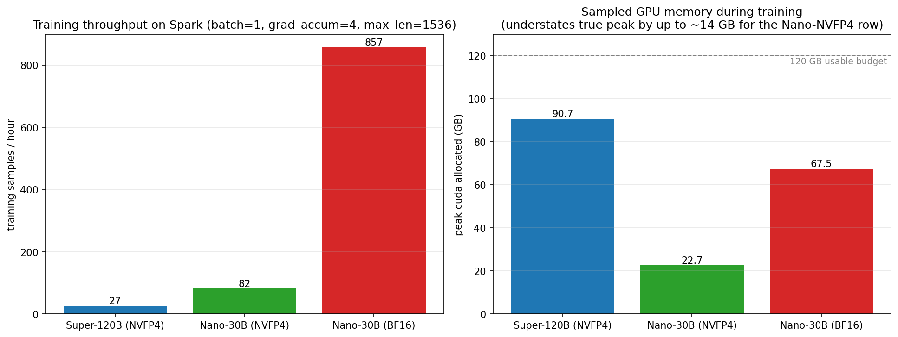
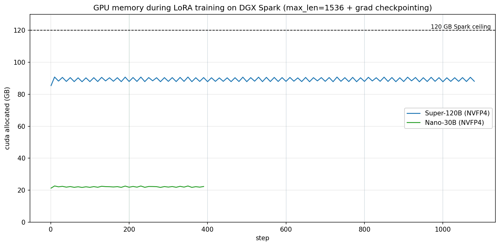
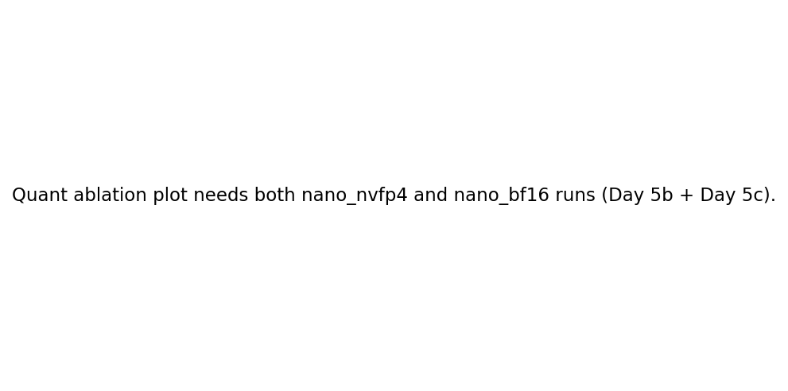
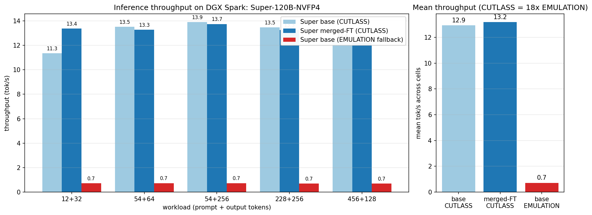
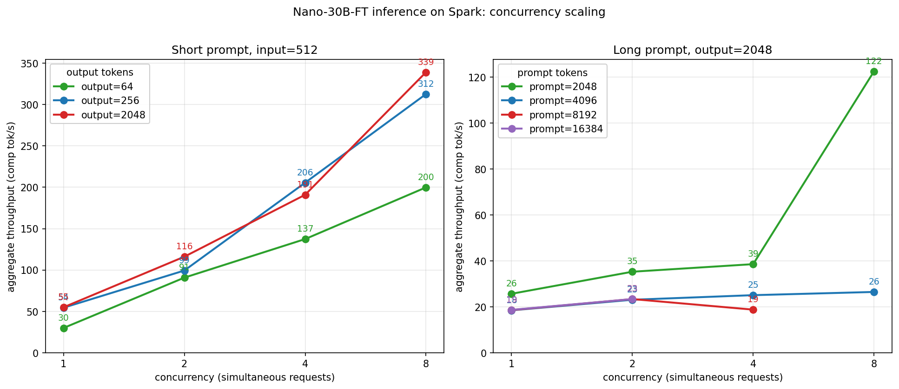
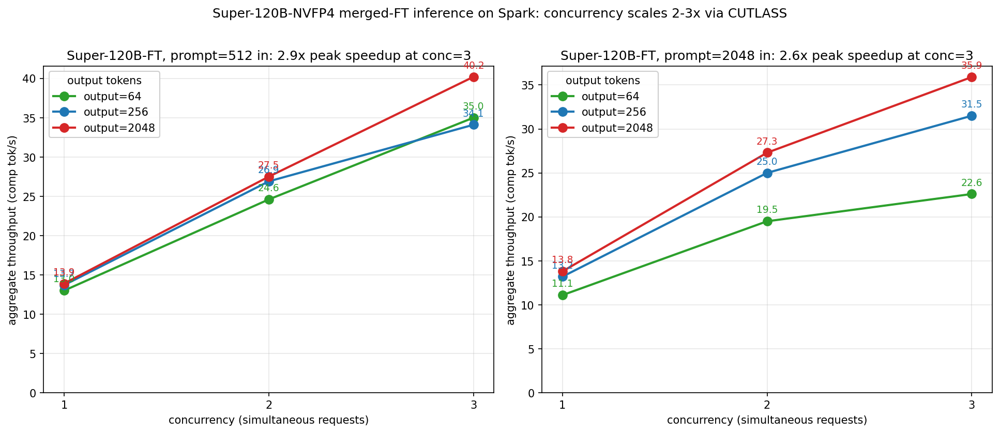
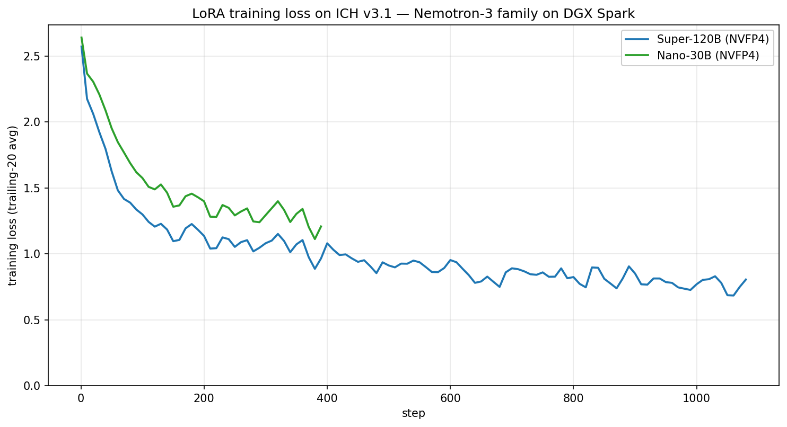

# nybbloris

**LoRA fine-tuning and runtime-LoRA serving for NVFP4 MoE models on consumer NVIDIA Blackwell (DGX Spark / GB10, sm_121, 128 GB unified memory)**

NVIDIA and partners ship the largest open MoE families in NVFP4 (4-bit) form so models well past the 100B class fit on a 128 GB GB10 box. NVFP4 weights are not a format that off-the-shelf LoRA libraries understand: packed E2M1 nibbles with `fp8_e4m3fn` block scales and an `fp32` per-tensor scale, in either NVIDIA ModelOpt or compressed-tensors layout, mixed with FP8 Mamba and shared-expert layers. nybbloris closes that gap with an NVFP4-aware LoRA training stack and validated serving recipes on a single GB10 system.

The core dequant kernel (a fused Triton implementation as of v1.2, see [Training throughput](#training-throughput)), the `NVFP4LoRALinear` module, and the fused-3D MoE machinery are all model-family agnostic; a per-family registry ([`nvfp4_lora/families.py`](nvfp4_lora/families.py)) binds them to a specific safetensors layout. As of v1.3 one unified trainer covers every supported family, validated on real checkpoints: Nemotron-3 Nano-30B-A3B and Super-120B-A12B (NVIDIA ModelOpt NVFP4), Mistral-Small-4-119B-2603 (RedHatAI compressed-tensors NVFP4), and Qwen3.5-122B-A10B (both the RedHatAI and NVIDIA NVFP4 releases). Unsupported layouts fail before any weight is read, with the broken assumption named, and [`scripts/inspect_nvfp4_checkpoint.py`](scripts/inspect_nvfp4_checkpoint.py) reports what any checkpoint needs. Porting a new NVFP4 family is one registry entry, not a kernel change.

> **Tip:** see [REPRODUCE.md](REPRODUCE.md) for the exact stack, [serve/README.md](serve/README.md) for the serving recipes, and [docs/TROUBLESHOOTING.md](docs/TROUBLESHOOTING.md) for the failure-signature playbook.

## Quickstart

> **The `nybbloris` CLI (runtime-LoRA).** For the productized end-to-end flow —
> `train` → `inspect` (the binding contract) → `serve --rekey auto --verify` —
> which serves the adapter **without re-quantizing the base** (so the fine-tune is
> preserved), see the **[worked example](docs/WORKED_EXAMPLE.md)**. The
> script-level walkthrough below stays valid and covers the merge-for-serve path.

Training environment:

```bash
git clone https://github.com/NvMayMay/nybbloris
cd nybbloris
python -m venv .venv-train && source .venv-train/bin/activate
pip install -r requirements.txt
MAX_JOBS=1 pip install --no-build-isolation causal-conv1d==1.6.2.post1
pip install flash-linear-attention==0.4.2
```

`MAX_JOBS=1` is required on Spark: parallel nvcc compilation gets OOM-killed on the 128 GB unified pool. Without `causal-conv1d`, the Mamba2 fast path falls back to a naive Python scan and training is impractical at any useful sequence length. `flash-linear-attention` is required for hybrid linear-attention models (the Qwen3.5 GatedDeltaNet layers) and is pinned to 0.4.2: 0.5.0's backward kernel crashes on GB10 (see Known issues on GB10).

Serving environment (separate venv recommended):

```bash
python -m venv .venv-serve && source .venv-serve/bin/activate
pip install vllm==0.21.0 flashinfer-python==0.6.8.post1 'torch==2.11.*'
```

Download an NVFP4 base from Hugging Face:

```bash
huggingface-cli download RedHatAI/Qwen3.5-122B-A10B-NVFP4 \
    --local-dir models/RedHatAI-Qwen3.5-122B-A10B-NVFP4
```

**Inspect the checkpoint first.** This reads only the config and the safetensors
index (seconds, no GPU) and tells you the storage format of every module, the
MoE topology, and exactly which LoRA mechanism a training run would use - or
the precise reason your target set would be rejected:

```bash
python scripts/inspect_nvfp4_checkpoint.py models/RedHatAI-Qwen3.5-122B-A10B-NVFP4 \
    --target-modules q_proj,k_proj,v_proj,o_proj
```

Prepare a chat-format JSONL dataset. Each line is a single example with a `messages` field in OpenAI chat format:

```json
{"messages": [{"role": "system", "content": "..."}, {"role": "user", "content": "..."}, {"role": "assistant", "content": "..."}]}
```

The training loop applies the model's chat template, so the template needs to render cleanly on a sample of the data before kicking off a full run. The FT data does not currently include reasoning traces, so the `enable_thinking` flag is not exercised.

Train with the unified trainer. The model family and the LoRA mechanism
(native NVFP4 vs PEFT) are detected from the checkpoint; a `--dry-run` first
catches OOM in minutes instead of mid-run:

```bash
python -u scripts/train_nvfp4_lora.py \
    --model-dir models/RedHatAI-Qwen3.5-122B-A10B-NVFP4 \
    --target-modules q_proj,k_proj,v_proj,o_proj \
    --output-dir adapters/my_run --dry-run

python -u scripts/train_nvfp4_lora.py \
    --model-dir models/RedHatAI-Qwen3.5-122B-A10B-NVFP4 \
    --target-modules q_proj,k_proj,v_proj,o_proj \
    --train-file train.jsonl --val-file val.jsonl \
    --epochs 3 --max-length 2048 \
    --output-dir adapters/my_run
```

Merge the trained adapter back into the NVFP4 base and re-quantize
(`merge_lora_into_ct_nvfp4.py` for compressed-tensors checkpoints,
`merge_lora_into_nvfp4.py` for ModelOpt/Nemotron; both support `--dry-run`):

```bash
python scripts/merge_lora_into_ct_nvfp4.py \
    --base-model-dir models/RedHatAI-Qwen3.5-122B-A10B-NVFP4 \
    --lora-adapter-dir adapters/my_run/best \
    --output-dir models/RedHatAI-Qwen3.5-122B-A10B-NVFP4-ft
```

Serve via vLLM using the launchers in [serve/](serve/) (copy
[serve/local_env.example.sh](serve/local_env.example.sh) to `serve/local_env.sh`
and point it at your model/adapter/venv roots first). For the original
Nemotron-3 Nano/Super pipeline (the v1.0 measurement runs), the per-model
scripts under [train/](train/) remain the validated path:

```bash
python train/train_super_nvfp4.py        # Nemotron-3-Super-120B (edit paths at top)
python scripts/merge_lora_into_nvfp4.py \
    --base-model-dir models/Nemotron-3-Super-120B-A12B-NVFP4 \
    --lora-adapter-dir <your-adapter-dir> \
    --output-dir models/Nemotron-3-Super-120B-A12B-NVFP4-ft
MODEL_DIR=models/Nemotron-3-Super-120B-A12B-NVFP4-ft ./serve/run_super_ft_merged.sh
```

The merged Super checkpoint serves at ~13 tok/s on Spark with the FT behavior baked into the served weights. See [serve/README.md](serve/README.md) for the Nano LoRA-attach recipe and the Super base-inference recipe, and [docs/SUPPORTED_TOPOLOGIES.md](docs/SUPPORTED_TOPOLOGIES.md) for the exact checkpoint-layout contract.

## Why use nybbloris

Single-GPU fine-tuning of Nemotron-3-Super on a 128 GB GB10 system previously required either training on a BF16 base in the cloud (the adapter then shifts under quantization), renting datacenter GPUs for the whole pipeline, or skipping fine-tuning entirely. nybbloris removes those constraints by training and serving directly on the NVFP4 base.

### Training fits comfortably on a single GB10

Measured at batch=1, max_len=1536, grad_accum=4, AdamW lr=1e-4, gradient checkpointing on, over 1 epoch on a chat-format JSONL dataset. Per-step time is the portable throughput metric; step time and final loss are production-run averages from the v1.0 ICH-v3.1 reference runs (1081 forward/backward steps). Memory column is `torch.cuda.max_memory_allocated` for the NVFP4 rows (taken from the matching sweep cell) and `max(cuda_alloc)` sampled at log time for the BF16 row (no torch-peak available, so this is a lower bound).

| Run | Base dtype | LoRA targets | Trainable params | GPU memory | Step time | Final loss (ICH-v3.1) |
|---|---|---|---:|---:|---:|---:|
| Super-120B (NVFP4) | NVFP4 | up_proj, down_proj (r=8) | 1216.4 M | 93.2 GB peak | 135.6 s | 0.81 |
| Nano-30B (NVFP4) | NVFP4 | up_proj, down_proj (r=8) | 216.4 M | 36.1 GB peak | 43.8 s | 1.00 |
| Nano-30B (BF16) | BF16 | up_proj, down_proj (r=8) | 216.4 M | 67.5 GB sampled | 4.2 s | 0.98 |



Super-120B NVFP4 training peaks at 93.2 GB on a 128 GB box, leaving headroom for longer sequences. Nano-30B NVFP4 peaks at ~36 GB. Plot 04's right panel and plot 03 show `max(cuda_alloc)` sampled at log time; the table column uses `torch.cuda.max_memory_allocated()` from the sweep, which captures the true peak (up to ~14 GB higher for the Nano-NVFP4 row). The sampled per-step memory series (109 logged points, every 10 steps across the 1081-step run) is flat for both models, with no leak or creep:



A (batch × max_len) sweep characterized the feasible region and identified `b=4, max_len=1024` as the throughput-optimal config that still fits the Spark memory budget. The comparison below uses the shipped sweep cells for both columns. Per-sample numbers are portable across dataset sizes; wall time scales linearly with example count.

| Model | Conservative (b=1, ml=1536) | Throughput-optimal (b=4, ml=1024) | Per-sample speedup |
|---|---|---|---:|
| Super-120B (NVFP4) | 137.94 s/sample, 93.2 GB peak | **36.69 s/sample**, 99.2 GB peak | **3.76x** |
| Nano-30B (NVFP4) | 49.25 s/sample, 36.1 GB peak | **18.55 s/sample**, 60.5 GB peak | **2.65x** |

The sweep cells are 3-step warm-state measurements; per-step rates are stable across the feasible region (full per-cell data in [results/training_throughput_sweep/](results/training_throughput_sweep/)). The first training table above uses the v1.0 production run averages (1081 forward/backward steps at b=1, ml=1536), which run ~1-11% faster per step than the matching sweep cell (Super: 1.7%, Nano: 11.1%) because the long run amortizes warmup. Loss curves for the v1.0 production runs are in [plots/train_metrics.json](plots/train_metrics.json) and rendered as plot 01. The b=4, ml=1024 throughput-optimal config has been validated end-to-end at the sweep cell level; long-run logs at that config are not shipped in v1.0.

**Operational note for Super training on GB10.** Launch Super-120B training from a clean boot (no prior vLLM serves, merges, or repeated benchmarks in the same boot). Loading the 75 GB NVFP4 base stresses the NVRM allocation paths and produces a burst of `NV_ERR_NO_MEMORY` lines in `/var/log/kern.log` during the load phase (observed: 174-225 events across the Super training and inference loads in this release's benchmark runs, all self-resolved within the load window). The train scripts set `PYTORCH_CUDA_ALLOC_CONF=expandable_segments:True` automatically to reduce allocator-side pressure. If a fresh NVRM burst or any `NVRM: Xid` event appears AFTER training has started, abort and reboot; the full failure-signature playbook is in [docs/TROUBLESHOOTING.md](docs/TROUBLESHOOTING.md).

For new long-context batched runs, the train scripts now default to dynamic padding plus length bucketing when `--batch > 1`, and `--grad-accum` applies to all physical batch sizes. A useful Super probe is `python train/train_super_nvfp4.py --batch 2 --max-len 4096 --grad-accum 2 --mask-prompt-labels --stop-at-step 20`; use the Nano script with the same flags for Nano. To reproduce the v1.0 max-padded sweep cells, pass the legacy knobs explicitly, for example `python train/train_super_nvfp4.py --batch 4 --max-len 1024 --grad-accum 1 --pad-to-max-length --no-length-bucketing --stop-at-step 200`. The default invocation remains the conservative batch=1, max_len=1536, grad_accum=4 path used for the v1.0 production run.

### Long-context training: validated configurations on GB10

The training script supports two training modes that together cover everything from short SFT up to 262k-token cached-context adaptation on a single Spark, all with the standard r=8 LoRA on `up_proj,down_proj` (no rank or target reduction).

- **Exact full-sequence** (default `--training-mode full_sequence`): all tokens backprop. Maximum trainable context bounded by activation memory.
- **Cached-prefix + trainable suffix** (`--training-mode cached_prefix_suffix --train-suffix-len N`): the prefix is prefilled under `torch.no_grad()` into a read-only attention K/V plus Mamba SSM-state cache, and only the trailing N tokens of the sequence receive gradients. This decouples trainable-window activation memory from total context length. Because next-token prediction shifts labels by one and the first suffix token's predictor is the final no-grad prefix hidden state, the suffix produces at most **N − 1** supervised next-token targets per step.

Single-step training results validated on Super-120B-NVFP4 on a 130.66 GB GB10 (all runs `--batch 1 --grad-accum 1`):

| Training mode | Total context | Trainable suffix | CUDA peak (backward) | Step wall (post-load) | Use case |
|---|---:|---:|---:|---:|---|
| Exact full-sequence | 16,384 | (full) | 101.9 GB | 3.5 min | Standard SFT where every token contributes loss; recommended path for contexts ≤16k |
| Cached-prefix + suffix | 4,096 | 2,048 | 85.7 GB | 3.1 min | Smallest cached-prefix shape; smoke validation |
| Cached-prefix + suffix | 16,384 | 2,048 | 85.8 GB | 6.9 min | All ICH-v3.1-style records (max 2,577 tokens) fit fully in the trainable window |
| Cached-prefix + suffix | 65,536 | 2,048 | 87.1 GB | 23.3 min | Longest validated context at suffix=2,048; ample room for retrieval-augmented or document-level pretexts |
| Cached-prefix + suffix | 262,144 | 1,024 | 90.8 GB | 22.4 min | Longest validated training context overall; suffix reduced to 1,024 to clear the backward allocator descriptor cliff |

Pre-watchdog single-step fits have reached 28,672 tokens at r=8 and 34,816 at r=2 with `down_proj` only. Those runs are characterized in the "Frontier (fit-tested, not certified)" sub-table below and are not promoted as training recipes; the watchdog-instrumented re-test of the same context range (LC-033 at 20,480 tokens) trips NVRM `mem_desc.c:1359` before backward, so the earlier passes are best read as "fits one step under lucky timing," not safety-certified.

Recommended flag set for all cached-prefix rows (the values used in the certified runs):

```
--batch 1 --grad-accum 1
--training-mode cached_prefix_suffix --train-suffix-len <SUFFIX> --prefix-chunk-len <CHUNK>
--loss-mode chunked_frozen_ce --loss-chunk-tokens 512
--optimizer adafactor
--sdpa-causal-no-mask --pooled-loader-buffers --moe-sparse-no-one-hot --mamba-cached-multitoken
--watchdog-min-available-gb 2 --watchdog-nvrm-errors --profile-memory-phases
```

Use `--prefix-chunk-len 2048` up to 16k context, `--prefix-chunk-len 4096` for 64k, `--prefix-chunk-len 8192` for 256k. The full per-row CLI invocations live in [`docs/LONG_CONTEXT_EXPERIMENTS.md`](docs/LONG_CONTEXT_EXPERIMENTS.md) (run IDs SUPER-LC-032, LC-046, LC-048, LC-050, LC-060).

#### Operational notes

- **Trainable-suffix ceiling.** Suffix sizes ≥ ~3,000 tokens currently fail at backward with NVIDIA NVRM `NV_ERR_NO_MEMORY` at `mem_desc.c:1359` despite ample byte-level headroom. The cliff is a per-process CUDA descriptor-pool ceiling, not byte-OOM; characterized across LC-062-LC-069 by `torch.cuda.memory_stats()['num_device_alloc']`. Suffix=2,048 (the validated rows above) covers the ICH-v3.1 distribution; larger suffixes for long-context adaptation are future-work.
- **`save_on_cpu` activation offload (`--activation-offload save_on_cpu`)** is plumbed but has been shown to be wall-time-only on GB10 unified memory: peak and reserved are unchanged vs no-offload, while step wall grows ~8% (LC-063). Use only as a diagnostic A/B.
- **Watchdog phase tags.** When the watchdog aborts, the printed line includes `phase=<init|cached_prefix_prefill|cached_suffix_forward|cached_suffix_loss|base_forward|chunked_loss|hf_forward_loss|backward|optimizer>` so a load-time NVRM transient (`phase=init`) is distinguishable from a training-time descriptor cliff at a glance. The NVRM journal watcher arms only after model load completes, so the known self-resolving NVRM bursts during NVFP4 weight load do not abort the run.
- **Optional alternate loss path.** `--loss-mode liger_flce` uses Liger Kernel's `FusedLinearCrossEntropyLoss` (requires `pip install liger-kernel`, parity-tested against the chunked path). It optimizes byte footprint rather than allocator-event count; in our profiling it did not lower the descriptor-pressure ceiling on GB10 and the chunked path remains the certified loss mode.
- **CUDA state recovery.** After any aborted or unusual run, if `torch.cuda.mem_get_info()` reports significantly less than the clean baseline (~127 GB free), the persistence-mode driver is holding state. Run `VENV_PY=/path/to/venv/bin/python sudo -E ./serve/diagnostics/release_cuda.sh` to drop OS page cache and restart `nvidia-persistenced`. Full playbook in [`docs/TROUBLESHOOTING.md`](docs/TROUBLESHOOTING.md).

#### Frontier (fit-tested, not certified)

These results predate the safety watchdog and the rank-preserving allocator patches. They demonstrate that a single training step fits one-shot, but they are explicitly *not* a recipe: the host memory headroom during the step is well under 3 GiB on every row, the later watchdog-instrumented test at 20,480 tokens (within this same range) failed with NVRM `mem_desc.c:1359` before backward, and the higher rows here use either reduced LoRA rank or a reduced target-module set, which collapses the trainable adapter capacity. The journal's own decision on these runs reads: *"reducing LoRA rank or dropping target modules is useful for mapping where activation and allocator pressure break, but it is not a satisfying context-window solution."*

| Total context | LoRA config | Status | Peak CUDA reserved | Host avail during step | Journal entry |
|---:|---|---|---:|---:|---|
| 24,576 | r=8, `up_proj+down_proj` | one-step fit | 117.4 GB | ~2.6 GiB | [SUPER-LC-013](docs/LONG_CONTEXT_EXPERIMENTS.md) |
| 28,672 | r=8, `up_proj+down_proj` | one-step fit | 121.5 GB | <1 GiB | [SUPER-LC-016](docs/LONG_CONTEXT_EXPERIMENTS.md) |
| 32,768 | r=4 alpha=8, `up_proj+down_proj` | one-step fit | 124.3 GB | nearly exhausted | [SUPER-LC-022](docs/LONG_CONTEXT_EXPERIMENTS.md) |
| 34,816 | r=2 alpha=4, **`down_proj` only** | one-step fit | (tiny-adapter probe) | (tiny-adapter probe) | [SUPER-LC-023](docs/LONG_CONTEXT_EXPERIMENTS.md) |

The 16,384 row in the certified table sits at peak 101.9 GB with ~15 GiB host headroom. The frontier rows above replace that headroom with the rank/target reductions and one-shot fit timing. For production training, the cached-prefix path at 65k or 256k context delivers larger effective context with much more headroom; for exact full-sequence training, 16,384 remains the safe ceiling.

### Quantization tax on adapter quality is negligible

The third row above is an ablation: identical LoRA hyperparameters trained against the BF16 Nano base. Final losses match to within 0.02 (1.00 vs 0.98) and the loss curves overlap step-for-step:



NVFP4 LoRA uses 36.1 GB peak vs 67.5 GB sampled at BF16 (true BF16 peak would be slightly higher) for the same workload. The quantized base is **roughly half the memory** with no detectable training-loss penalty on this 1081-example dataset. Broader-domain evaluation is on the roadmap.

### Serving runs at native NVFP4 speeds via vLLM CUTLASS

Production serving uses vLLM 0.21's CUTLASS native FP4 MoE backend, validated on Super-120B both for the base model and for the merged-FT checkpoint produced by `scripts/merge_lora_into_nvfp4.py`:



Merged-FT serving runs at 13.2 tok/s mean across 5 workload cells - `(prompt, output)` pairs of (12, 32), (54, 64), (54, 256), (228, 256), and (456, 128) - landing in a 12.2-13.7 tok/s range. That is at parity with base CUTLASS on the same cells (11.3-13.9 tok/s, mean 12.9). The EMULATION fallback measures 0.70-0.73 tok/s on the same workload (~18x slower) and is retained only for the case where CUTLASS breaks in a future vLLM release.

### Concurrency scales well on Spark's unified memory

The single-stream tok/s above is one worker. The 128 GB unified LPDDR5x pool is an architectural advantage for batched serving on Spark: KV cache for additional concurrent requests fits inside the same memory the model weights already live in, with no PCIe transfer to bottleneck batching. Discrete-GPU local-AI systems (16-32 GB VRAM) saturate batched inference much earlier because KV cache competes with model weights for a small VRAM pool. This advantage holds for the Nemotron-3 NVFP4 stack:



Nano-30B-FT measured across six workload shapes (3 short-prompt + 3 long-prompt) at concurrency 1, 2, 4, 8 (`--max-num-seqs 8`, ctx=4096). Short-prompt cells (the headline batched-throughput case):

| Workload | conc=1 | conc=2 | conc=4 | conc=8 | speedup at conc=8 |
|---|---:|---:|---:|---:|---:|
| prompt=512, output=64 | 30 tok/s | 91 tok/s | 137 tok/s | 200 tok/s | 6.7x |
| prompt=512, output=256 | 54 tok/s | 99 tok/s | 206 tok/s | 312 tok/s | 5.7x |
| prompt=512, output=2048 | 55 tok/s | 116 tok/s | 191 tok/s | **339 tok/s** | 6.2x |

Long-prompt cells (prompt = 2048 and up) become compute-bound at prefill: TTFT typically 0.1-3 s, rising to 13-16 s when the vLLM scheduler interleaves long prefills with short decodes. Aggregate throughput across the full sweep ranges from ~5 tok/s (long prompt + short output, TTFT-dominated) up to ~339 tok/s (short prompt + long output at conc=8). Full data in [results/inference_concurrency_sweep/](results/inference_concurrency_sweep/).

Long-context capacity scales the same way: in a server provisioned for ctx=32768 with `--max-num-seqs 2`, 2 concurrent 512-prompt requests achieve 116 tok/s; long-prompt requests in the same server (for example prompt=16384) drop to ~23 tok/s due to prefill cost. At ctx=16384 with `--max-num-seqs 4`, peak short-prompt throughput is 191 tok/s. Full sweep across 4 ctx tiers (4K, 8K, 16K, 32K), 6 workload shapes each, with concurrencies capped per tier by `max_num_seqs`: 1/2/4/8 at 4K and 8K, 1/2/4 at 16K, 1/2 at 32K.

Super-120B concurrency on the merged-FT path also scales. A prior attempt that bundled vLLM startup with `--enable-lora --lora-modules` (dynamic LoRA attach) did not complete within 900 s, leading to the previous "single-stream only" framing. The merge-then-serve path removes that overhead; on the merged Super checkpoint, vLLM CUTLASS at `--max-num-seqs=3, ctx=4096` serves 3 concurrent requests cleanly:



| Workload | conc=1 | conc=2 | conc=3 | speedup at conc=3 |
|---|---:|---:|---:|---:|
| prompt=512, output=64 | 13.0 tok/s | 24.6 | 35.0 | 2.69x |
| prompt=512, output=256 | 13.7 tok/s | 26.9 | 34.1 | 2.49x |
| prompt=512, output=2048 | 13.9 tok/s | 27.5 | **40.2** | **2.89x** |
| prompt=2048, output=64 | 11.1 tok/s | 19.5 | 22.6 | 2.04x |
| prompt=2048, output=256 | 13.2 tok/s | 25.0 | 31.5 | 2.39x |
| prompt=2048, output=2048 | 13.8 tok/s | 27.3 | 35.9 | 2.60x |

Mean aggregate tok/s rises from 13.1 (conc=1) → 25.1 (conc=2) → 33.2 (conc=3). Single-request TTFT scales as expected (0.5 s at conc=1, ~0.9 s at conc=3 for prompt=512; longer for prompt=2048 prefill). Full per-trial JSONLs at [results/super_inference_concurrency_sweep/](results/super_inference_concurrency_sweep/). Concurrency above 3 was not tested in this release.

### Training throughput

NVFP4 weight dequant runs as a fused Triton kernel (`nvfp4_lora/triton_dequant.py`) as of v1.2. The kernel does the full unpack + E2M1 LUT + group scale + per-tensor scale + bf16 store in one dispatch, with the nibble kept in a register (no int64 intermediate). The dispatcher in `dequantize_nvfp4_weight` falls through to the original PyTorch path when the tensor is on CPU, Triton is not importable, or `out_dtype` is not bf16, so no call site has to change.

Per dequant call, measured on a Blackwell B10 / GB10 Spark (PyTorch 2.11.0+cu130, Triton 3.6.0):

| shape | PyTorch | Triton | speedup |
|---|---:|---:|---:|
| 4096 x 4096 bf16 | 6.02 ms | 0.28 ms | 21.6x |
| 4096 x 2048 bf16 | 3.04 ms | 0.13 ms | 23.5x |
| 4096 x 1024 bf16 | 1.44 ms | 0.06 ms | 24.8x |
| 6144 x 256 bf16  | 0.47 ms | 0.03 ms | 14.5x |

End-to-end LoRA training step time on a 119B-class NVFP4 MoE with 128 routed experts per layer drops from **984 s to 92 s (10.7x)** at bsz=1, grad_accum=8, seq_len=2048 with gradient checkpointing on. The end-to-end ratio is lower than the per-call ratio because attention, optimizer step, and Python orchestration now make up a larger share of the total; dequant is no longer the bottleneck. Parity against the PyTorch path is bit-identical (`max_abs_diff = 0.0` across all tested shapes and both modelopt and compressed-tensors quant formats). See [`smoke_tests/triton_dequant_parity.py`](smoke_tests/triton_dequant_parity.py).

### Training loss curves

LoRA on Super-120B crosses avg20 < 1.0 around step 370 and continues to improve to 0.81 by epoch end. Nano-30B's curve is shifted right but follows the same shape: it crosses avg20 < 1.0 around step 810 and ends at ~1.00 after one epoch.



## Supported models

### Shipped on `main`

| Model | Base inference | LoRA serving | Throughput |
|---|---|---|---|
| Nemotron-3-Nano-30B-A3B-NVFP4 | vLLM marlin via [`serve/serve_nemotron_nvfp4.sh`](serve/serve_nemotron_nvfp4.sh) | Dynamic via `--enable-lora --lora-modules` (same script attaches an adapter) | 28-55 tok/s short-prompt single-stream (4.9-26 tok/s single-stream on long prompts); **up to ~339 tok/s aggregate at conc=8** (ctx=4096) |
| Nemotron-3-Super-120B-A12B-NVFP4 | vLLM CUTLASS via [`serve/run_super_base_inference_cutlass.sh`](serve/run_super_base_inference_cutlass.sh) | Merge-then-serve via [`scripts/merge_lora_into_nvfp4.py`](scripts/merge_lora_into_nvfp4.py) + [`serve/run_super_ft_merged.sh`](serve/run_super_ft_merged.sh) | **11-14 tok/s** single-stream (base + merged-FT); merged-path **scales to ~40 tok/s aggregate at conc=3** on ctx=4096 |

The merge-then-serve workflow exists because vLLM 0.21's CUTLASS MoE kernel does not support LoRA at request time on sm_121 (`CutlassExpertsFp4.supports_lora() = False`), and the EMULATION fallback that does claim LoRA support hits a Triton kernel bug. Dynamic LoRA at CUTLASS speeds is parked as [Phase 2](docs/PHASE2.md). For the full backend matrix and per-failure-mode reasoning, see [serve/README.md](serve/README.md) and [docs/TROUBLESHOOTING.md](docs/TROUBLESHOOTING.md).

### Other NVFP4 families (training now on `main`)

The core stack (dequant kernel, NVFP4LoRALinear, fused-3D MoE, save/load round-trip) is family-agnostic, and the per-family loaders now ship on `main` together with a unified trainer. The following have been validated end-to-end (load + LoRA train + adapter save) against community NVFP4 checkpoints:

| Model | Quant format | Notes |
|---|---|---|
| Mistral-Small-4-119B-2603 | compressed-tensors (RedHatAI) | MLA attention (q_b_proj, kv_b_proj, o_proj) is BF16, so LoRA uses standard PEFT wrapping; routed and shared experts are NVFP4. Loader handles the `language_model.*` prefix translation between the multimodal `Mistral3ForConditionalGeneration` wrapper and the on-disk safetensors keys. Full 3-epoch LoRA run certified on a single GB10 (430 updates, 12.2 h). |
| Qwen3.5-122B-A10B | compressed-tensors (RedHatAI) | Hybrid backbone: 36 of 48 layers are GatedDeltaNet linear attention (needs `flash-linear-attention` + `causal-conv1d`, see GB10 known issues), 12 are full attention with NVFP4 q/k/v/o. Quantized attention means PEFT cannot wrap the targets; the trainer bakes LoRA into `NVFP4LoRALinear` instead. |
| Qwen3.5-122B-A10B-NVFP4 | NVIDIA ModelOpt | MoE-only NVFP4 serving variant. Served via vLLM 0.22.1 with the same NVFP4 backend used for Nemotron-3 Nano. |
| Qwen3.6-35B-A3B-NVFP4 | NVIDIA ModelOpt | Smaller MoE in the same family; serves with `--enable-lora --lora-modules` for dynamic adapter switching. |

### Unified multi-family trainer

[`scripts/train_nvfp4_lora.py`](scripts/train_nvfp4_lora.py) trains any supported family with the right strategy detected from the checkpoint itself:

* **Family** (auto class, expert-tensor key translation, multimodal-tower freezing) resolves from `config.json` `model_type` via the shared registry in [`nvfp4_lora/families.py`](nvfp4_lora/families.py) - the same registry the loader, the inspector and the merge scripts use, so train-time and merge-time key translation cannot drift apart.
* **LoRA mechanism** is detected, not configured: if the `--target-modules` are NVFP4-quantized in the checkpoint, LoRA is baked into `NVFP4LoRALinear` at load; if they are plain BF16 (BF16-attention recipes), standard PEFT wrapping with a family-scoped regex.
* **Target coverage is fail-fast.** Every module matching a target suffix is classified individually before load. A suffix that is quantized in some layers but BF16 in others is a hard error (override with `--allow-partial-targets`); a suffix that matches nothing is a hard error. FP8 targets train natively (`FP8LoRALinear`) and need no flag. The exact coverage report is written to `<output_dir>/target_coverage.json` so every adapter records what was and was not trained.
* **Loading is strict.** On-disk tensors that map to no model path fail at load time with the offending keys named, and after loading the trainer asserts no parameter is left on the meta device (frozen multimodal towers are explicitly allowlisted per family). `--permissive-load` restores warn-and-continue for bring-up of new families only.
* **MoE expert storage is probed, not assumed.** Per-expert routed experts in either compressed-tensors or ModelOpt key naming; checkpoints whose quantizer gave gate and up different per-tensor scales automatically get split gate/up storage (exact, slightly slower) instead of the fused single-scale fast path. See [docs/SUPPORTED_TOPOLOGIES.md](docs/SUPPORTED_TOPOLOGIES.md).
* **Crash safety**: atomic adapter saves, rotated `checkpoint_step_N/` dirs, best-by-val-loss tracking at `<output_dir>/best/`, and full resume via `--resume-from` (adapter + optimizer + scheduler + RNG + deterministic per-epoch data order).

```bash
python -u scripts/train_nvfp4_lora.py \
    --model-dir /models/RedHatAI-Qwen3.5-122B-A10B-NVFP4 \
    --target-modules q_proj,k_proj,v_proj,o_proj \
    --train-file train.jsonl --val-file val.jsonl \
    --epochs 3 --max-length 2048 \
    --output-dir adapters/my_run
```

All four families train through this one entry point, including Nemotron-3 (`nemotron_h`, validated with a Nano-30B dry-run + 3-step smoke; the per-model scripts under [train/](train/) remain as the frozen v1.0 measurement-run artifacts). Porting another NVFP4 family means adding ONE entry to `FAMILIES` in [`nvfp4_lora/families.py`](nvfp4_lora/families.py); run [`scripts/inspect_nvfp4_checkpoint.py`](scripts/inspect_nvfp4_checkpoint.py) on the checkpoint first, then follow [docs/PORTING.md](docs/PORTING.md) (worked Qwen3.5 example). The supported checkpoint-layout contract is spelled out in [docs/SUPPORTED_TOPOLOGIES.md](docs/SUPPORTED_TOPOLOGIES.md).

### Known issues on GB10 (DGX Spark)

Lessons from bringing up 119-122B NVFP4 training on the 131 GB unified-memory GB10, consolidated in [`nvfp4_lora/gb10_prep.py`](nvfp4_lora/gb10_prep.py):

* **Weight-sized buffers must be allocated with an explicit `device="cuda"`.** CPU and GPU share one DRAM pool, but they fail differently under pressure: the kernel reclaims page cache for CPU allocations, while NVRM allocations fail immediately with `NV_ERR_NO_MEMORY`. A weight-sized buffer that lands on CPU (e.g. a forgotten `device=` on the MoE expert container) permanently starves CUDA and manifests as an OOM kill on the first training step with a constant anon-RSS fingerprint.
* **Drop shard page cache after weight assembly.** Streaming ~70 GB of safetensors leaves the pages cached, and NVRM cannot force-reclaim them. `gb10_prep.drop_shard_page_cache()` releases them via `posix_fadvise(DONTNEED)`, no privileges needed.
* **`flash-linear-attention` is pinned to 0.4.2.** Version 0.5.0's `prepare_wy_repr_bwd_kernel` crashes with `Triton Error [CUDA]: misaligned address` on GB10 during the gated-delta-rule backward (forward is fine, which makes it easy to misattribute). Hybrid linear-attention models (Qwen3.5) need fla + `causal-conv1d`; without them transformers silently falls back to a much slower torch path.
* **`NVFP4_EVAL_CACHE_GB`** caps the process-wide eval-mode bf16 weight cache in `NVFP4LoRALinear` (default 30). Set it to ~8 for NVFP4-attention models where post-load headroom is ~50 GB.
* NVML/`nvidia-smi` report `N/A` for memory on GB10; use `torch.cuda.mem_get_info()` + `psutil.virtual_memory()` (`gb10_prep.memory_snapshot()`).

## How it works

NVFP4 weights are stored as packed E2M1 nibbles in `uint8` (2 elements per byte) with a separate `fp8_e4m3fn` group scale every 16 elements, plus a single `fp32` per-tensor scale. Each NVFP4 Linear layer is wrapped at training time by `nvfp4_lora.linear.NVFP4LoRALinear`, which:

1. Keeps the original NVFP4 tensors **frozen** (no gradient flow).
2. Dequantizes the weight to bf16 **on the fly** inside a custom `autograd.Function`, so no full bf16 copy of the base lives in memory between steps.
3. Adds a standard low-rank LoRA delta in bf16 with trainable `lora_A` (r, in) and `lora_B` (out, r) matrices.
4. Forward: `y = dequant(W) @ x + (alpha / r) * B @ A @ x`. Backward: gradients flow only into `lora_A` and `lora_B`.

The saved adapter follows PEFT's on-disk key naming (`base_model.model.<module>.lora_{A,B}.weight`) and ships `adapter_config.json`. Loading the merged checkpoint via the standard HuggingFace plus vLLM path is the validated workflow; round-tripping the raw adapter file through `peft.PeftModel.from_pretrained` has not been tested in this release and may need an explicit `PeftModel` wrapper.

For Nemotron-3-Super, only the routed MoE experts are NVFP4: shared-expert MLPs and Mamba projections are FP8. The loader at `nvfp4_lora.loader.load_nemotron_with_nvfp4_lora` walks the safetensors index, replaces NVFP4 Linears with `NVFP4LoRALinear` and FP8 Linears with `FP8LoRALinear` (frozen FP8 base + trainable bf16 LoRA), so an FP8 LoRA target trains natively rather than being frozen. (The pooled-storage loader path, `pooled_loader_buffers=True`, has no FP8 LoRA support and raises a clear error if FP8 targets are requested; use the default non-pooled path to LoRA FP8 layers.)

### Why NVFP4 (not plain FP4)

A bare E2M1 element (one sign, two exponent, one mantissa bit) represents magnitudes up to 6 before scaling, which is nowhere near enough to cover transformer weight distributions. A single outlier in any tensor saturates the 4-bit space and the rest of the block degenerates. NVFP4 wraps E2M1 in a two-level scaling scheme that solves this:

- Each block of 16 weights gets its own `fp8_e4m3fn` scale, so local variance does not saturate the 4-bit range.
- One `fp32` per-tensor scale absorbs the overall weight magnitude.

NVFP4 uses real `fp8` block scales, which give finer outlier handling than MXFP4's `ue8m0` power-of-two scales (the open OCP alternative). NVIDIA targets NVFP4 on Blackwell with native FP4 GEMM kernels. Accuracy of NVFP4 vs the BF16 reference is documented on the [NVIDIA model cards](https://huggingface.co/nvidia/NVIDIA-Nemotron-3-Super-120B-A12B-NVFP4); the typical published claim is sub-1% delta on standard benchmarks. The NVFP4 weights themselves are produced by [NVIDIA Model Optimizer](https://github.com/NVIDIA/Model-Optimizer).

## Target hardware

- **GPU**: NVIDIA GB10 (Blackwell consumer, sm_121).
- **Memory**: 128 GB unified LPDDR5x.
- **CUDA**: 13.0 (required for sm_121).
- **Verified on**: NVIDIA DGX Spark. Should also work on other GB10 SKUs (Asus, HP) with the same internal config.
- **Not tested**: Hopper, Ada, or datacenter Blackwell. The training code does not depend on sm_121-specific kernels, but the serving recipes are tuned for the GB10 memory budget.

## Correctness checks

Three smoke tests under [`smoke_tests/`](smoke_tests/) exercise the library: `dequant_correctness.py` (CPU-only NVFP4 dequant round-trip), `linear_smoke.py` (NVFP4LoRALinear forward parity, small NVFP4 layer on GPU), and `loader_smoke.py` (loads Nano-30B-NVFP4 with the production loader, runs a few optimizer steps; needs the Nano model on disk plus the training venv).

```bash
# Dequant round-trip: NVFP4 uint8 + fp8 scales + fp32 scale -> bf16
python smoke_tests/dequant_correctness.py --model-dir /path/to/Nemotron-3-Nano-30B-A3B-NVFP4

# Forward parity: NVFP4LoRALinear output == bf16-dequant weight + LoRA delta
python smoke_tests/linear_smoke.py --model-dir /path/to/Nemotron-3-Nano-30B-A3B-NVFP4

# Loader: replace NVFP4 modules in a small Nemotron-3 slice, confirm grads
# flow only into LoRA params and not into the frozen base
python smoke_tests/loader_smoke.py --model-dir /path/to/Nemotron-3-Nano-30B-A3B-NVFP4
```

For end-to-end merge validation, `scripts/validate_merge.py` audits a merged checkpoint: per-tensor cosine similarity, no-op fraction, integrity of non-weight files vs base, and optional adapter consistency checks for `alpha_over_r` plus translated LoRA target count. Pass `--lora-adapter-dir` when the source adapter is available:

```bash
python scripts/validate_merge.py \
    --base-model-dir /path/to/Nemotron-3-Super-120B-A12B-NVFP4 \
    --merged-model-dir /path/to/Nemotron-3-Super-120B-A12B-NVFP4-ich-v1.0 \
    --lora-adapter-dir /path/to/adapter
```

The Phase 1 ICH-v1.0 merge validated at cosine p01 = 0.9998 with 6/40961 (0.01%) no-op tensors and all 11 non-weight files byte-identical to base.

`scripts/distinguish_ft.py` runs a temperature=0 distinguishing-prompt test that exposes the FT signal qualitatively: 100 prompts (29 domain + 71 synthetic filler for statistical baseline) sent to the base server then to the merged-FT server, with per-prompt completion diff. On the Phase 1 ICH-v1.0 merge, 79/100 prompts produced different completions; raw outputs in [results/distinguishing_v1/](results/distinguishing_v1/) for visual inspection.

## Repository layout

```
nvfp4_lora/                  # core library
  families.py                # per-family registry: key translation, PEFT scope, skip lists, MoE class
  linear.py                  # NVFP4LoRALinear (on-the-fly dequant + LoRA delta)
  loader.py                  # multi-family NVFP4 loader + target inventory + strict-load/no-meta checks
  experts.py                 # NVFP4Experts3D fused-3D routed-MoE container + per-family replacement
  dequant.py                 # NVFP4 -> bf16 dequant kernel (Triton fast path + PyTorch fallback)
  gb10_prep.py               # GB10 UMA helpers: alloc conf, page-cache drop, memory snapshot
train/                       # frozen v1.0 Nemotron-3 training scripts (edit paths at top of each)
  train_super_nvfp4.py
  train_nano_nvfp4.py
  train_nano_bf16.py         # BF16 quantization ablation
scripts/
  inspect_nvfp4_checkpoint.py  # FIRST command for any new checkpoint: layout + trainability report
  train_nvfp4_lora.py        # unified multi-family LoRA trainer (auto family + LoRA mode, resume)
  train_watchdog.sh          # crash watchdog: auto-resume from latest checkpoint (systemd-driven)
  merge_lora_into_nvfp4.py   # merge LoRA into ModelOpt NVFP4 base + re-quantize (--dry-run)
  merge_lora_into_ct_nvfp4.py  # merge LoRA into compressed-tensors NVFP4 base (--dry-run, --self-test)
  validate_merge.py          # per-tensor cosine + no-op-fraction audit
  distinguish_ft.py          # base vs FT distinguishing-prompt test
tests/                       # CPU-only suite (79 tests) run by CI; no GPU required by construction
serve/
  local_env.example.sh                  # machine-local model/adapter/venv roots (copy to local_env.sh)
  run_super_base_inference_cutlass.sh  # recommended Super base recipe
  run_super_ft_merged.sh                # recommended Super-FT serve recipe
  serve_nemotron_nvfp4.sh               # Nano launcher (base + optional LoRA)
  run_super_base_inference.sh           # Super EMULATION fallback (~0.7 tok/s)
  vllm_patches/                         # marlin chunked-repack micro-optimization
  diagnostics/                          # safety-thread wrapper, microrepro, bench client
plots/
  make_plots.py              # render the README plots
  extract_train_metrics.py   # parse training logs -> train_metrics.json
smoke_tests/                 # library correctness tests, including GPU-backed loader smoke
docs/
  SUPPORTED_TOPOLOGIES.md    # the exact checkpoint-layout contract (topology v1)
  PORTING.md                 # bring-your-own-NVFP4-model guide (worked Qwen3.5 example)
  RELEASE_CHECKLIST.md       # what to run before tagging a release
  TROUBLESHOOTING.md         # failure-signature playbook incl. GB10 unified-memory signatures
  PERFORMANCE_ROADMAP.md     # five routes to close the NVFP4-vs-bf16 throughput gap
  PHASE2.md                  # dynamic LoRA at CUTLASS speeds (parked)
  LESSONS.md                 # development journal
results/                     # published bench + validation artifacts
```

`vllm` and the training stack do not need to share a venv. The reference setup runs `nvfp4-train` for training and `nvfp4-serve` for vLLM, with separate PyTorch versions (2.12 for training, 2.11 for serving). Full version table in [REPRODUCE.md](REPRODUCE.md).

## Roadmap

- **Dynamic LoRA at CUTLASS speeds for Super-120B.** Phase 1 ships the merge-then-serve workflow; Phase 2 adds a runtime-swap path via a post-MoE LoRA delta hook on top of the CUTLASS kernel. Design notes in [docs/PHASE2.md](docs/PHASE2.md).
- **Native FP4 training kernels.** v1.2 adds a fused Triton dequant that closed most of the gap (per-call 14-25x, end-to-end LoRA step 10.7x faster). A native FP4 GEMM that bypasses the bf16 materialization entirely would be the next lever; [docs/PERFORMANCE_ROADMAP.md](docs/PERFORMANCE_ROADMAP.md) lists the routes.
- **Attention LoRA on Nemotron-3.** Mamba2-attention blocks differ from the standard transformer-attention layout that off-the-shelf LoRA tooling targets. Extension is possible once the attention layout is validated against the loader.
- **Grouped MoE expert GEMM.** The routed-expert forward currently dequantizes and multiplies one expert at a time (up to 256 sequential kernel-launch pairs per layer). A batched implementation (K experts per dequant + bmm) is built and CPU-parity-tested, pending GPU validation. Expected to close most of the per-step gap between expert-heavy and expert-light models.
- **Dynamic LoRA serving for compressed-tensors NVFP4.** A runtime vLLM patch keeps the CUTLASS NVFP4 MoE backend active while attention-only adapters serve via punica, enabling request-time adapter switching without merge-then-serve. Built and statically verified, pending GPU validation.
- **Multi-GPU.** Tensor parallelism is not tested. GB10 systems ship single-GPU.
- **Bundled eval harness.** Not shipped today. The training scripts produce a standard PEFT-format adapter; any benchmark consumes it.

## Scope

- The unified trainer accepts any `--target-modules` whose coverage checks pass; the validated recipes are attention q/k/v/o on Qwen3.5 (native NVFP4), MLA attention on Mistral-Small-4 (PEFT), and `up_proj`/`down_proj` on the Nemotron routed experts (legacy `train/*.py`). In Super-120B, shared expert MLPs and Mamba projections are FP8, not NVFP4; FP8-landing targets train natively in the unified trainer via `FP8LoRALinear` (frozen FP8 base + bf16 LoRA), no flag needed (the legacy scripts demoted them to frozen and printed a count).
- The frozen v1.0 `train/*.py` scripts have their paths hardcoded at the top; they are kept as proven measurement-run artifacts. New runs should use `scripts/train_nvfp4_lora.py`.
- The exact checkpoint-layout contract (what "supported NVFP4 model" means precisely) is [docs/SUPPORTED_TOPOLOGIES.md](docs/SUPPORTED_TOPOLOGIES.md).

## Contributing

Issues and pull requests are welcome. For larger changes (new model family loaders, native FP4 training paths, dynamic-LoRA-at-CUTLASS work), opening an issue first to align on scope keeps the discussion focused.

## License

This repository is Apache 2.0. See [LICENSE](LICENSE).

The Nemotron-3 base models are licensed under the [NVIDIA Nemotron Open Model License](https://www.nvidia.com/en-us/agreements/enterprise-software/nvidia-nemotron-open-model-license/), which is more restrictive than Apache 2.0. Merged-FT checkpoints produced by `scripts/merge_lora_into_nvfp4.py` are derivative works of the NVIDIA base and fall under the Nemotron license's redistribution terms. See [REPRODUCE.md](REPRODUCE.md) for the licensing breakdown.

## Citation

```bibtex
@software{nybbloris_2026,
  title  = {nybbloris: LoRA fine-tuning and runtime-LoRA serving for NVFP4 MoE on consumer Blackwell},
  year   = {2026},
  url    = {https://github.com/NvMayMay/nybbloris}
}
```
